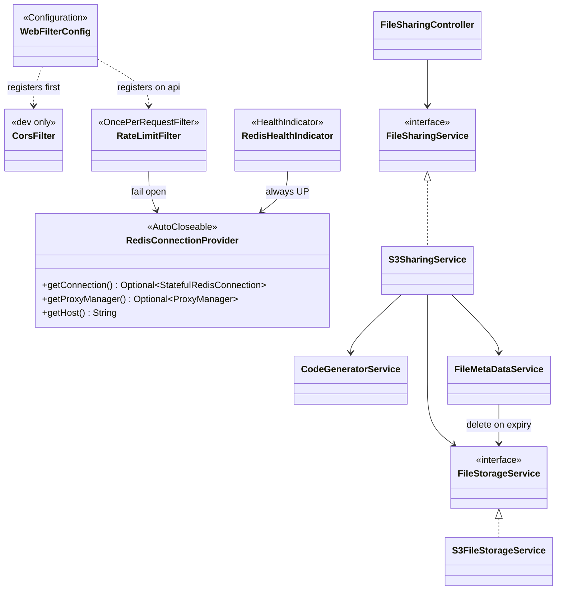
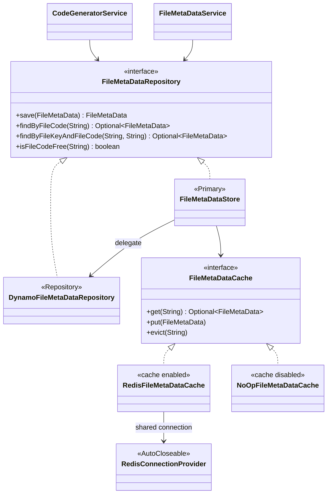
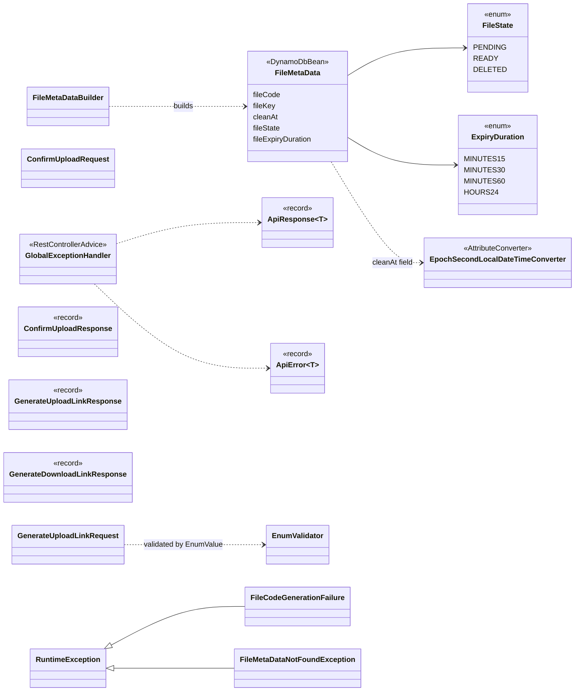

# Backend class hierarchy

Package root: `me.dhiren9939.mint`.

## Request path and services

Filters are plain servlet filters, there is no Spring Security. Spring Boot's forwarded-headers handling runs first, then CORS (dev profile only, so 429 responses still carry CORS headers), then `RateLimitFilter`, which only covers `/api/*`.

`RedisHealthIndicator` shows up as `redis` in `/actuator/health` on the management port (8081). It reports whether the shared connection is open but is always UP, because the app runs without Redis, and it is not part of the liveness group the load balancer checks.

## Metadata storage with write-through cache

The store is `@Primary`, so the services receive it wherever they inject `FileMetaDataRepository`. `mint.cache.enabled` (default `true`) picks the Redis or the no-op cache.

Write-through rules:

- `save` writes to Dynamo first, then sets the cache entry with `EXAT min(now + ttl, cleanAt)`. The TTL is `mint.cache.ttl-seconds` (default 300), so a stale entry heals itself quickly; `cleanAt` only caps it. If `cleanAt` has already passed, it deletes the key instead.
- If the cache write fails, the cache tries a `DEL`, logs, and never fails the request.
- Reads check the cache first and fall back to Dynamo on a miss. Reads never fill the cache, and "not found" is never cached.
- `isFileCodeFree` skips the cache and does a consistent read on Dynamo.
- When an expired file is marked `DELETED`, `FileMetaDataService` also deletes the object from S3. A failed delete is logged and not retried.

## Domain, DTOs and errors

## Configuration beans

| Config | Provides |
| --- | --- |
| `AwsConfig` | `S3Client`, `S3Presigner`, `DynamoDbClient`, `DynamoDbEnhancedClient` |
| `RateLimitConfig` | `RedisClient`, `RedisConnectionProvider` (one connection shared by the rate limiter and the cache) |
| `WebFilterConfig` | CORS filter (non-prod profiles), `RateLimitFilter` and its registration on `/api/*` |
| `OpenApiConfig` | OpenAPI metadata |
