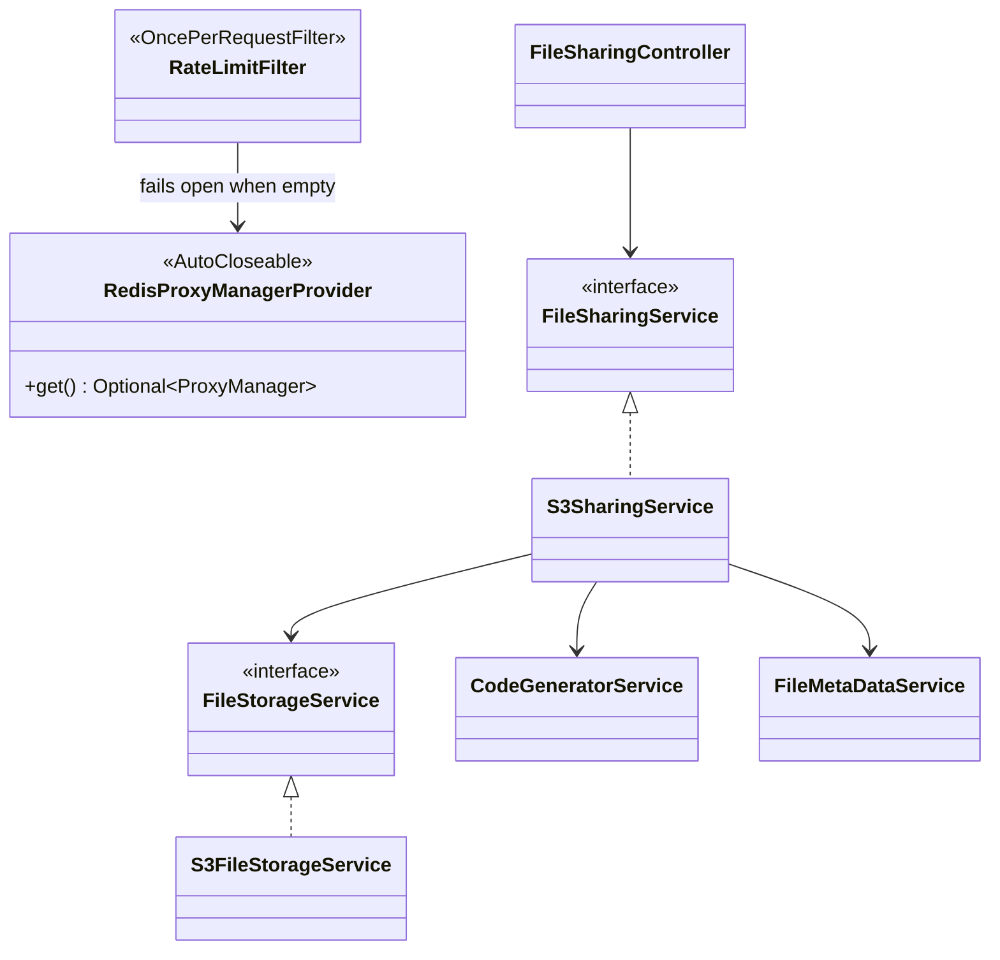
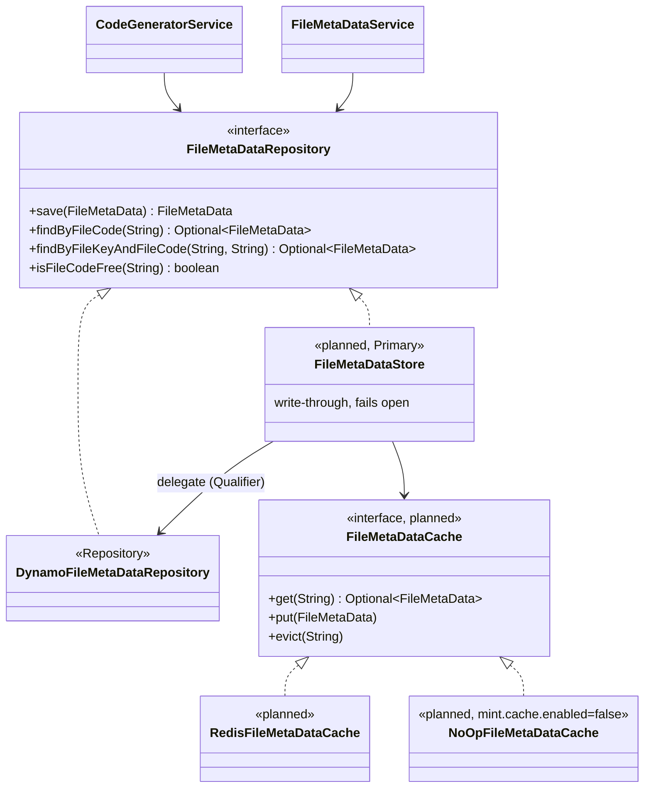
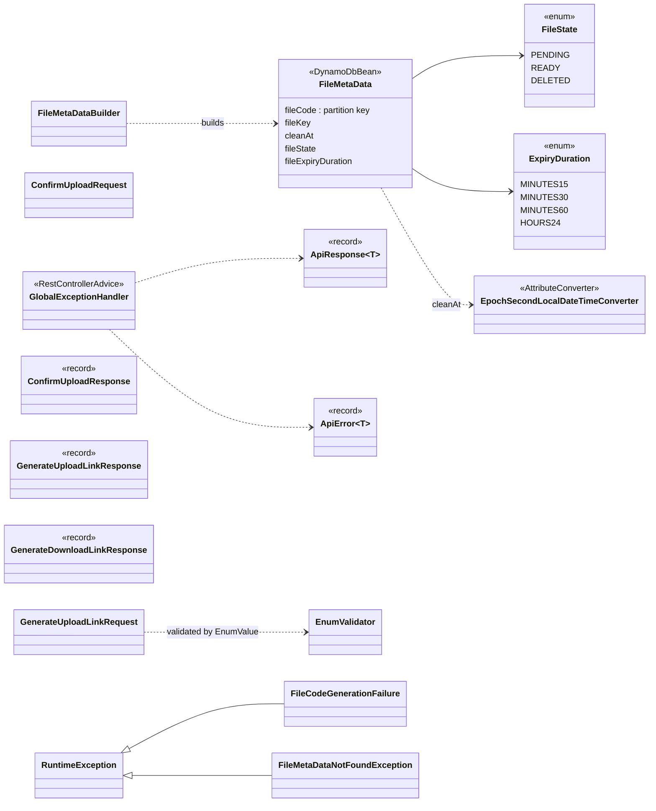

# Backend class hierarchy

Package root: `me.dhiren9939.mint`. Classes marked **planned** don't exist yet; the rest match the code.

## Request path and services

## Metadata storage with write-through cache

The store is `@Primary`, so the services receive it wherever they inject `FileMetaDataRepository`. Today `CachedFileMetaDataRepository` is a pass-through placeholder for the store.

Write-through rules:

- `save` writes to Dynamo first, then sets the cache entry with `EXAT cleanAt`; if `cleanAt` has already passed, it deletes the key instead.
- If the cache write fails, the store tries a `DEL`, logs, and never fails the request.
- Reads check the cache first and fall back to Dynamo on a miss. Reads never fill the cache, and "not found" is never cached.

## Domain, DTOs and errors

## Configuration beans

| Config | Provides |
| --- | --- |
| `AwsConfig` | `S3Client`, `S3Presigner`, `DynamoDbClient`, `DynamoDbEnhancedClient` |
| `RateLimitConfig` | `RedisClient`, `RedisProxyManagerProvider` |
| `SecurityConfig` | CORS source, security filter chain, `RateLimitFilter` registration |
| `OpenApiConfig` | OpenAPI metadata |
