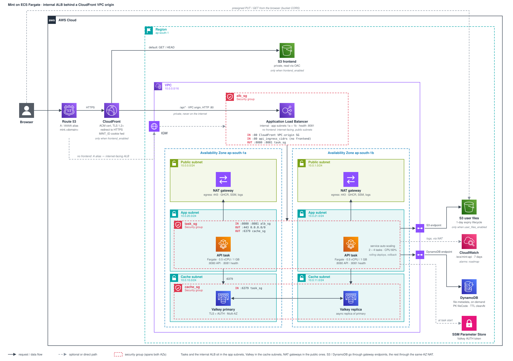

# Infrastructure

Generated from `infra/` (Terraform, AWS provider 6.39.0, region `ap-south-1`). Each environment gets its own state and toggles; resource names are `mint` in prod and `mint-<env>` elsewhere.

The frontend and user-files bucket are optional (`frontend_enabled`, `user_files_enabled`). With `frontend_enabled`, CloudFront fronts both S3 and the API, and the API's load balancer is internal: CloudFront reaches it through a VPC origin. Without it, the load balancer is internet-facing and the domain points straight at it, open to `api_ingress_cidrs` only. The cache, DynamoDB table, ECS service and IAM roles are always created.

The diagram is a hand-laid-out SVG (`docs/infra.svg`) using the AWS architecture icons. Security groups are the red dashed boxes, with their rules listed inside. Edit the SVG directly when the Terraform changes.

## Request path

1. The browser resolves `mint.<domain>` to CloudFront and connects over HTTPS.
2. `/api/*` goes to the VPC origin: CloudFront connects over a network interface in the app subnets to the internal ALB, on HTTP port 80. The ALB has no public address, and only this account's CloudFront distributions are admitted.
3. The ALB forwards to a healthy task on port 8080. Health checks go to `/actuator/health/liveness` on port 8081, which no listener exposes.
4. Everything else is served from the frontend bucket through Origin Access Control.
5. Uploads and downloads go straight from the browser to the user-files bucket with presigned URLs.

The client IP for rate limiting comes from `X-Forwarded-For`. The app uses Tomcat's native handling (`server.forward-headers-strategy=native`), which reads the header from the right and skips private proxy addresses, so a client can't fake it by sending its own header.

## ECS service

| Setting | Value |
| --- | --- |
| Launch type | Fargate, x86, 0.5 vCPU / 1 GB per task |
| Tasks | 2 to 4, target tracking on 60% average CPU (scale out after 60s, in after 300s) |
| Placement | App subnets in both AZs, no public IP |
| Deploys | Rolling, 100% min healthy / 200% max, circuit breaker with rollback |
| Health check grace | 120s (startup takes about 50s on 0.5 vCPU) |
| Deregistration delay | 30s, then SIGTERM; the app shuts down gracefully within 20s, SIGKILL after 30s |
| Logs | CloudWatch `/ecs/mint-api`, 7 days |
| Image | `ghcr.io/dhiren9939/mint-backend`; Terraform seeds `:latest`, `backend-cd` deploys the commit tag |

The task definition carries the configuration the old Compose file did: `SPRING_PROFILES_ACTIVE=prod`, `REDIS_HOST`, `DYNAMO_TABLE`, `USER_FILES_BUCKET` and the JVM flags as environment variables. The Valkey AUTH token is stored as the SSM SecureString `/<name>/redis-auth-token`, and ECS injects it as `REDIS_AUTH_TOKEN` when a task starts. Terraform ignores changes to the service's task definition and desired count, so CI deploys and autoscaling own them.

## Deploys

`backend-cd` builds the image, pushes the commit and `latest` tags to GHCR, then:

1. Downloads the latest revision of the task definition family (Terraform owns everything in it except the image).
2. Swaps the `api` container's image for the commit tag and registers a new revision.
3. Updates the service and waits for the rolling deploy to finish.
4. Fails unless the service's primary deployment is the new revision and completed, since a rolled-back deploy also ends stable.

`create-app` runs `infra-cd` and then deploys the frontend and backend; `destroy-app` tears the environment down. Neither needs SSH.

## Security groups

| Group | Direction | Port | Peer |
| --- | --- | --- | --- |
| `alb_sg` | ingress | 80 | `CloudFront-VPCOrigins-Service-SG` (frontend enabled, rule lives in the `cloudfront` module) |
| `alb_sg` | ingress | 80 | `api_ingress_cidrs` (frontend disabled) |
| `alb_sg` | egress | 8080, 8081 | `task_sg` |
| `task_sg` | ingress | 8080, 8081 | `alb_sg` |
| `task_sg` | egress | 443 | `0.0.0.0/0` |
| `task_sg` | egress | 6379 | `cache_sg` |
| `cache_sg` | ingress | 6379 | `task_sg` |

## Network

| Subnet | ap-south-1a | ap-south-1b | Holds |
| --- | --- | --- | --- |
| Public | 10.0.0.0/24 | 10.0.1.0/24 | NAT gateways, the ALB when there is no frontend |
| App | 10.0.20.0/24 | 10.0.21.0/24 | ECS tasks, the internal ALB, CloudFront's VPC-origin interfaces |
| Cache | 10.0.10.0/24 | 10.0.11.0/24 | Valkey primary and replica |

Each app subnet routes `0.0.0.0/0` to the NAT gateway in its own AZ, so one AZ failing doesn't cut the other off. DynamoDB and S3 gateway endpoints sit on the app route tables, so that traffic skips the NAT and its per-GB charge. Image pulls from GHCR, the SSM secret and CloudWatch logs go through the NAT.

## Modules

| Module | Resources |
| --- | --- |
| `vpc` | VPC, IGW, public, app and cache subnets in two AZs, a NAT gateway and Elastic IP per AZ, route tables, DynamoDB and S3 gateway endpoints, ElastiCache subnet group, `alb_sg`, `task_sg`, `cache_sg` and their rules |
| `ecs` | Cluster, log group, SSM parameter for the AUTH token, task definition, ALB, target group and listener, service, autoscaling target and CPU policy |
| `iam` | Task role (S3 Get/Put/DeleteObject on the user-files bucket, DynamoDB GetItem/PutItem on the metadata table) and execution role (`AmazonECSTaskExecutionRolePolicy`, read the SSM parameter); both trust `ecs-tasks.amazonaws.com` from this account only |
| `s3` | Frontend bucket, user-files bucket with 1-day lifecycle expiry and CORS for the site origin |
| `cloudfront` | Distribution (S3 default origin, VPC origin for `/api/*`), OAC, bucket policy for OAC, origin request policy forwarding the `MINT_ID` cookie, managed security headers on `/api/*`, the `alb_sg` rule for the VPC origin |
| `route53` | Alias A/AAAA to CloudFront, or an alias A record to the internet-facing ALB |
| `dynamodb` | `file-metadata` table, TTL on `cleanAt` |
| `elasticache` | Valkey replication group, 2 nodes, failover on, encrypted in transit and at rest |

## Notes

- Nothing accepts SSH; there is no instance to log into. Logs are in CloudWatch.
- While an environment is up it pays for two NAT gateways and their Elastic IPs, the ALB and 2 to 4 tasks. `destroy-app` removes all of it.
- CloudFront creates `CloudFront-VPCOrigins-Service-SG` and network interfaces in the app subnets for the VPC origin. They are not in Terraform state and AWS removes them some time after the VPC origin is deleted, so a teardown can fail on the subnets or VPC and need a rerun.

## Monitoring

`infra/modules/monitoring` builds one `aws_cloudwatch_dashboard` per environment, named `${name}-dashboard`. It's driven entirely by optional input objects (`alb`, `ecs`, `ec2`, `rds`, `dynamo`, `valkey`, `nat`, `loadgen`); each section only appears when its backing object is passed in, so the same module serves prod (ECS/ALB/Dynamo/Valkey/NAT) and the EC2 bench arms (EC2/RDS instead) unchanged. Widgets stack in a 3-column, width-8, height-6 grid, section by section, so any subset of sections renders without overlap.

Dashboard sections, top to bottom:

1. **Outcome (RED).** Request rate by uri + status, 4xx/429/5xx rate, latency p50/p95/p99 (from the ALB's `TargetResponseTime` on ECS, or a per-instance Micrometer placeholder on EC2 arms — server-side percentiles are per instance, so true cross-instance percentiles come from k6, not this row), and cache hit/miss/error (`Mint` namespace, `mint.cache.get` by the `result` dimension).
2. **App saturation.** Tomcat threads busy vs max, connections, heap used vs max, GC pause, process CPU and live threads — all from the custom `Mint` Micrometer namespace, so this row looks the same in every arm.
3. **Compute.** ECS: Container Insights CPU/memory/running-task-count, ALB healthy hosts, ELB 5xx/rejected/target-connection-error counts, plus NAT `ErrorPortAllocation` per gateway. EC2 (bench arms): CPU, `CPUCreditBalance`, `CPUSurplusCreditsCharged`, CWAgent `mem_used_percent`/`tcp_established`/`tcp_time_wait`, and procstat CPU/memory for the `java` process (and `redis-server` too, on the sql arm's Redis sidecar).
4. **Dependency timers (app view).** `mint.ratelimit.duration`, `mint.cache.get`/`mint.cache.put`, `mint.db.duration` by the `op` dimension, `mint.redis.connected`, plus Hikari `pending`/`active`/`acquire` when an `rds` object is present.
5. **Datastores (AWS view).** DynamoDB `SuccessfulRequestLatency` (Get/Put), consumed RCU/WCU, throttles and system errors when `dynamo` is present. Valkey `EngineCPUUtilization`, `EvalBasedCmdsLatency`, Get/Set command latency, connections, memory % and hits/misses when `valkey` is present. RDS CPU/credits, connections, read/write latency and IOPS, disk queue depth and freeable memory when `rds` is present.
6. **Load generator.** k6 arrival rate, dropped iterations, p95/p99 and error rate, plus the load-gen instance's CPU/network, when `loadgen.enabled` is set. The k6 metric names (`K6` namespace) are provisional — Stage 3 defines the actual k6 → CloudWatch pipeline, and these widgets will need updating once that's wired up.
7. **Logs.** Two Logs Insights table widgets against the environment's log group (`ecs.log_group_name`, or `log_group_name` directly on EC2 arms): one filtering `@message like /ERROR/`, one filtering `@message like /Rate limiter unavailable|Cache read failed/`.

`infra/modules/monitoring/queries.tf` also saves three reusable Logs Insights query definitions against the same log group: errors grouped by logger, fail-open warnings over time, and the slowest requests by `duration_ms`.

Supporting wiring: the `ecs` module now enables Container Insights on the cluster (`container_insights_enabled`, default `true`) and exposes `alb_arn_suffix`, `target_group_arn_suffix` and `log_group_name`; its task definition sets `MINT_ENV` and merges an `extra_environment` map into the container's environment list. The `vpc` module exposes `nat_gateway_ids`; `elasticache` exposes `replication_group_id` and `member_cluster_ids`. The task role's IAM policy grants `cloudwatch:PutMetricData`, restricted by a `cloudwatch:namespace = "Mint"` condition, so the app can publish its custom metrics but nothing else.

Alarms are out of scope — this is dashboards only. Dashboards and log groups live and die with their environment; results are captured (widget PNGs, k6 summaries) before `destroy-app` runs.

### Symptom → bottleneck

| Signal | What failed |
| --- | --- |
| k6 dropped iterations > 0, load-gen CPU high | the load generator, so the run is invalid |
| Tomcat threads busy = 50, CPU low, latency up | blocked on a dependency; check row 4 for which timer grew |
| CPU ≈ 100% (instance or task) | compute |
| `CPUCreditBalance` 0 / surplus charged rising | burstable CPU (EC2 or RDS) |
| heap ≈ max, GC pause up | JVM memory |
| Hikari pending > 0 | DB connection pool; then check RDS CPU / credits / latency / DiskQueueDepth |
| DynamoDB throttles / latency up | DynamoDB |
| `mint.ratelimit.duration` up, Valkey EngineCPU / EVAL latency up | Redis (the global-bucket hot key) |
| ALB `RejectedConnectionCount` / ELB 5xx, running tasks = 4 | ALB / the scaling cap |
| NAT `ErrorPortAllocation` | NAT |
